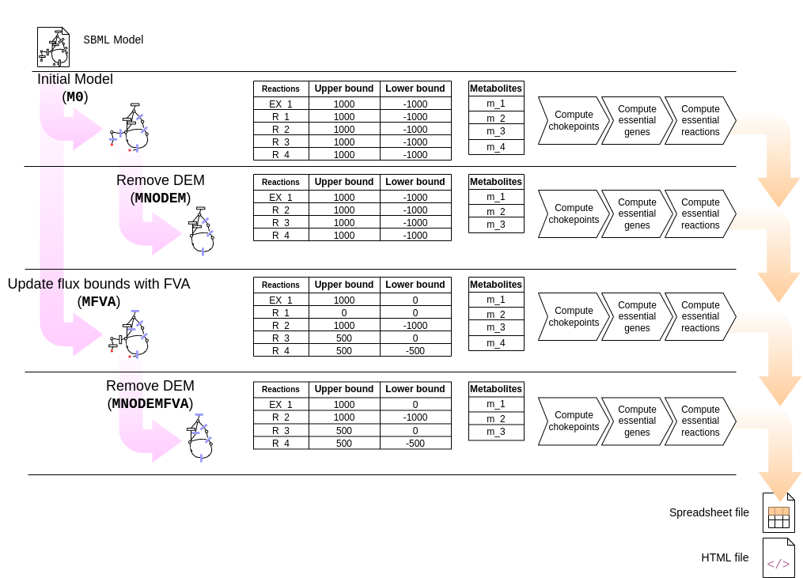

.. _vulnerabilities-documentation:

4. Compute vulnerabilities
======================

Given a genome-scale model in SBML format, contrabass computes chokepoints, dead-end metabolites, essential reactions, and essential genes, and saves the results in a spreadsheet report and a html report.

4.1. Pseudocode
******************
This section presents the pseudocode with procedures on how each vulnerability is computed:

- Find chokepoints on a model

  .. code-block::

    function find_chokepoints(model)
        chokepoint_list = empty list
        for reaction in model
            if reaction upper flux bound not equal 0 and lower flux bound not equal 0
                for reactant in reaction
                    if reaction is the only consumer of reactant
                        chokepoint_list = chokepoint_list + (reaction, reactant)
                for product in reaction
                    if reaction is the only producer of product
                        chokepoint_list = chokepoint_list + (reaction, product)
        return chokepoint_list

- Find essential reactions

  .. code-block::

    function find_essential_reactions(model)
        essential_reactions = empty list
        for reaction in model
            knock out reaction
            if flux_balance_analysis on model is 0
                essential_reactions = essential_reactions + reaction
            undo knock out
        return essential_reactions

- Find and remove dead-end metabolites

   See :ref:`dem-documentation`

- Refine model with FVA

   Besides for computing the previous vulnerabilities, CONTRABASS constraints model fluxes to a certain growth (optimal growth by default) and computes again vulnerabilities for comparison.
   See :ref:`fva-documentation`

4.2. Command
**********************

Vulnerabilities can be computed on the model with the following command, where `MODEL.xml` is the file with the SBML model.::

    $ contrabass report critical-reactions MODEL.xml
.The prevoius command computes vulnerabilities using an optimal growth constraint. To use suboptimal growth constraints use the ``fraction``
to provide the fraction of optimal growht to use when constraining the model to a certain growth. See using a fraction of 95% growth::

    $ contrabass report critical-reactions MODEL.xml --fraction 0.95

.
The following figure shows the pipeline of the vulnerabilities computation process. For a given SBML file, computations are performed on 4 models with the following acronyms:
    1. Model in the SBML file (``M0``).
    2. Model without DEM (``MNODEM``).
    3. Model refined with FVA, i.e. with flux bounds updated according to FVA (``MFVA``);
    4. Model refined with FVA and without DEM (``MFVANODEM``).

4.2.1. Spreadsheet data
++++++++++++++++++++++++++

The previous command produces a spreadsheet file containing the following sheets:

- ``model_info``: General model information.
- ``reactions``: List of reactions of the model
- ``metabolites``: List of metabolites of the model
- ``genes``: List of genes of the model
- ``reactions_FVA``: Upper and lower flux bound of each reaction obtained with Flux Variability Analysis.
- ``metabolites_FVA``: Upper and lower flux bound of each reaction obtained with Flux Variability Analysis grouped by metabolite.
- ``reversible_reactions``:  List of reversible reactions of the model before and after FVA refinement.
- ``chokepoints``: Chokepoint reactions and the metabolite/s they produce/consume. Chokepoints are computed in 4 different models:   

  1. Input model in the SBML file.    
  2. Model without DEM.    
  3. Model refined with FVA.     
  4. Model refined with FVA and without DEM.    
- ``dead-end``:  Dead-end metabolites before and after FVA refinement.
- ``essential genes``: List of essential genes of the model. Essential genes are computed in the 4 previously listed models.
- ``essential reactions``: List of essential reactions of the model. Essential reactions are computed in the 4 previously listed models.
- ``comparison``: Comparison of chokepoint, essential reactions and essential gene reactions in the 4 previously listed models.
- ``summary``:  Comparison the size of the previous sets and their intersections.

