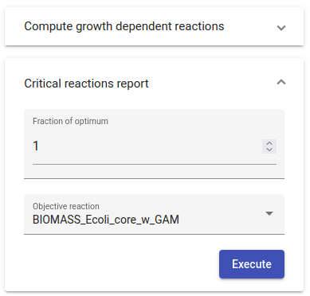

9. Online Web App
===============

CONTRABASS can also be executed though the online web application at CONTRABASS-Online_.

9.1. Usage
------------

9.1.1. Submit model
*********************

To load a model in the web app drag-and-drop a valid SBML model to the box on the left (see image below).
CONTRABASS also comes with 4 sample models to try out the tool. To use one of the 4 sample models, simply click on one
of the ```Try this model``` buttons in the box on the right (see image below). (see image below).


9.1.2. Run operation
************************

If the model is correctly formatted, CONTRABASS will read the model and notify when it is ready.
When the read completes successfully, a row similar to the following with the model data will appear on the page:


.
CONTRABASS allows you to execute the two operations explained above in the documentation, that is:
    - **Compute growth dependent reactions**: produce an overview of the critical reactions in the model and explore how they vary when the growth constraints vary (See :ref:`growth-op-documentation`).
    - **Compute critical reactions**: compute sets of critical reactions and their intersections for a given growth rate (See :ref:`vulnerabilities-documentation`).

If we click on one of the 2 accordions showing the 2 possible operations, they will expand showing the optional parameters
that we can adjust before starting the execution (see image below).
Once we are done with the parameters, to start the execution simply click the ```Execute``` button.



While the selected operation is being executed, the page will show feedback on the computations performed:


9.1.3. Download reports
************************

Once the selected operation ends its execution, the web will display 2 buttons (see image below) to download different reports:

    - **Download spreadsheet**: Download the spreadsheet report of the computation.
    - **View report**: View and online interactive report with the result of the computation.


.. image:: _static/step5.png
    :align: center
    :alt: step 5


.. _CONTRABASS-Online: https://github.com/openCONTRABASS/CONTRABASS/blob/master/LICENSE

