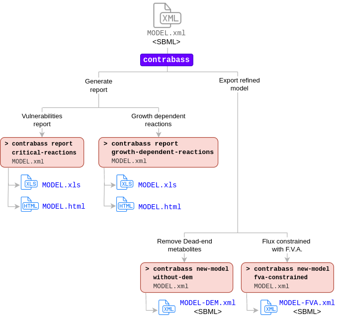

3. Tool commands
==================

3.1 Flowchart
-------------

The next flowchart provides a graphical description of the available operations that can be performed with CONTRABASS and their respective commands, along with the output each command produces:

3.2 Commands and parameters
---------------------------

More information about the parameters of the tool can be obtained by executing ``contrabass -h``.

::

	$ contrabass -h

        Usage: contrabass [OPTIONS] COMMAND [ARGS]...

          Compute vulnerabilities on constrained-based models

        Options:
          -h, --help     Show this message and exit.
          -V, --version  Show the version and exit.

        Commands:
          new-model  Export refined constrained-based model.
          report     Compute vulnerabilities on constrained-based models.

Two options are available regarding the production of vulnerabilities reports:

::

    $ contrabass report -h

    Commands:
      critical-reactions
      growth-dependent-reactions

Three options are available when exporting a new model:

::

    $ contrabass new-model

    Commands:
      fva-constrained              Export a new model with its (maximum and...
      fva-constrained-without-dem  Export a new model with its (maximum and...
      without-dem                  Export a new model where Dead-End...

